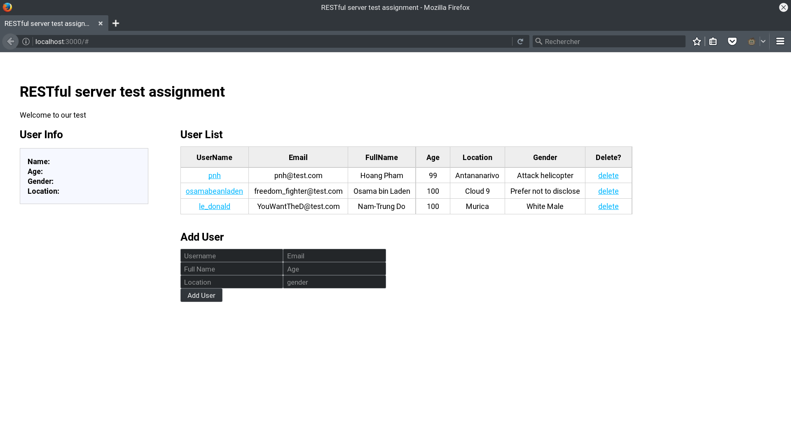

# rest-test
Technology Workshop assignment: http://cwbuecheler.com/web/tutorials/2014/restful-web-app-node-express-mongodb/

# Deployment
First, go into the cloned directory and install the dependencies: `npm install`.

Run the app: `npm start`

It should look similar to this:

